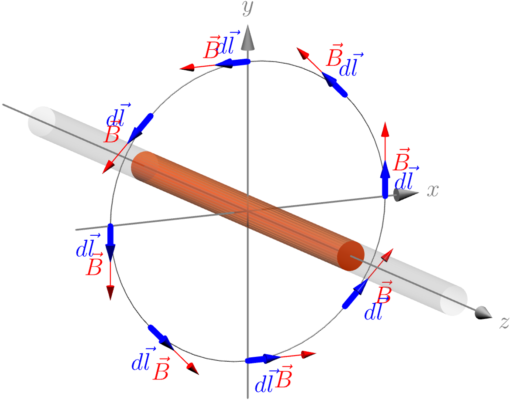

:::{aside} <wiki:Olga_Ladyzhenskaya>
dedicó su carrera al estudio matemático de las ecuaciones de Navier-Stokes —aquellas que describen el flujo de fluidos y que se expresan con el operador nabla, demostrando resultados fundamentales sobre la existencia y unicidad de sus soluciones. Su trabajo sobre la regularidad de las soluciones de ecuaciones en derivadas parciales, incluida su contribución al [decimonoveno problema de Hilbert](https://es.wikipedia.org/wiki/Decimonoveno_problema_de_Hilbert), constituye la base teórica de la dinámica de fluidos computacional (CFD).

```{figure} ./../images/Olga_Ladyzhenskaya.jpg
:label: fig-Olga_Ladyzhenskaya
:alt: retrato de Dra. Olga Ladýzhenskaya
:align: center
Dra. Olga Ladýzhenskaya (1922 - 2004). Foto: K. Jacobs, [MFO](https://opc.mfo.de/detail?photo_id=2435) (CC BY-SA 2.0).
```
:::

```{note} Objetivos
Al completar esta lección, serás capaz de
1. **Definir el operador nabla** $(\nabla)$ en coordenadas cartesianas y **calcular el gradiente, la divergencia, el rotacional y el laplaciano** de campos escalares y vectoriales.
2. **Interpretar físicamente** las operaciones del nabla e **identificarlas en ecuaciones fundamentales** de la física.
3. **Expresar transformaciones entre coordenadas cartesianas y curvilíneas ortogonales**, e interpretar geométricamente los vectores base y los factores de escala asociados.
4. **Generalizar el operador nabla** a coordenadas curvilíneas, deducir las expresiones del gradiente, la divergencia, el rotacional y el laplaciano en función de los factores de escala, y **aplicarlas a los sistemas de coordenadas cilíndricas y esféricas**.
```

+++ { "part": "abstract" }  
El estudio de sistemas de coordenadas curvilíneas es fundamental para modelar y analizar fenómenos físicos que presentan simetrías no cartesianas o que se desarrollan en geometrías complejas. Mientras que las coordenadas cartesianas son adecuadas para sistemas homogéneos y de simetría rectangular, muchas situaciones en física e ingeniería —como el flujo en una tubería cilíndrica, el campo eléctrico alrededor de una carga puntual o la propagación de ondas en una cavidad esférica— requieren el uso de sistemas curvilíneos como el cilíndrico, el esférico o sistemas más generales. Por otro lado, el operador vectorial diferencial nabla, $\nabla$, desempeña un papel central en física e ingeniería como herramienta para cuantificar la variación espacial de magnitudes escalares y vectoriales. Al actuar como gradiente, divergencia o rotacional, $\nabla$ permite describir cómo cambian los campos en el espacio, ya sea midiendo la dirección y magnitud de su crecimiento, evaluando la densidad de fuentes o sumideros, o caracterizando la rotación local de un flujo. Este enfoque unificado resulta esencial en disciplinas como la mecánica de fluidos, la transferencia de calor, el electromagnetismo y la mecánica del continuo, donde las ecuaciones de conservación —de masa, cantidad de movimiento y energía— se expresan de forma compacta y generalizada mediante $\nabla$, adaptándose a distintos sistemas de coordenadas según la geometría del problema.
+++


(nabla)=
# 💉 Operador nabla

El [operador nabla](https://es.wikipedia.org/wiki/Nabla) ($\nabla$) es un [operador vectorial](https://es.wikipedia.org/wiki/Operador_diferencial) que se utiliza
ampliamente en cálculo vectorial. Su versatilidad y utilidad lo convierten en una herramienta fundamental en física e ingeniería,
especialmente en el análisis de campos vectoriales y escalares.

Este operador se puede aplicar a funciones escalares y vectoriales para obtener varios tipos de resultados importantes en el cálculo vectorial,
como [*el gradiente*](https://es.wikipedia.org/wiki/Gradiente), [*la divergencia*](https://es.wikipedia.org/wiki/Divergencia_(matem%C3%A1tica)) y [*el rotacional*](https://es.wikipedia.org/wiki/Rotacional). En el electromagnetismo, [*las ecuaciones de Maxwell*](https://es.wikipedia.org/wiki/Ecuaciones_de_Maxwell) se expresan usando divergencia y rotacional; en la mecánica de fluidos, [*las ecuaciones de Navier-Stokes*](https://es.wikipedia.org/wiki/Ecuaciones_de_Navier-Stokes), que describen el flujo de fluidos, utilizan nabla para representar la aceleración y la conservación de la masa. El operador nabla es indispensable para describir y analizar fenómenos físicos complejos.

En coordenadas cartesianas, el **operador diferencial nabla** ($\nabla$)
se define mediante
$$\nabla = \hat{\iota}\frac{\partial}{\partial x}+\hat{\jmath}\frac{\partial}{\partial y}+\hat{\kappa}\frac{\partial}{\partial z}=\left(\frac{\partial }{\partial x},\frac{\partial }{\partial y},\frac{\partial }{\partial z}\right)=(\partial_x, \partial_y,\partial_z).$$

En lo subsiguiente, denotaremos una función escalar de la forma
$$\phi=\phi(x,y,z)$$ y una función vectorial mediante
$$\vec{V}(x,y,z)=V_x(x,y,z)\hat{\iota}+V_y(x,y,z)\hat{\jmath}+V_z(x,y,z)\hat{\kappa}.$$

Dependiendo de cómo se combine con funciones escalares o vectoriales, el nabla produce diferentes operadores diferenciales fundamentales:

### Gradiente 

El **gradiente** de una función escalar $\phi$ produce un campo vectorial que apunta en la dirección de máximo crecimiento de $\phi$, con magnitud igual a la tasa de cambio en esa dirección:

$$\mbox{grad}\phi=\nabla \phi= \hat{\iota}\frac{\partial \phi}{\partial x}+\hat{\jmath}\frac{\partial \phi}{\partial y}+\hat{\kappa}\frac{\partial \phi}{\partial z}$$

El gradiente permite aproximar una función localmente mediante su expansión de Taylor de primer orden:

$$f(\vec{x}+\Delta \vec{x})\approx f(\vec{x})+\nabla f(\vec{x})\cdot \Delta \vec{x},$$

válida cuando el desplazamiento $\Delta \vec{x}$ es suficientemente pequeño.

#### Derivada direccional

La derivada direccional de una función escalar $\phi$ en una dirección
dada por un vector unitario $\hat{n}$ mide la tasa de cambio de $\phi$
en esa dirección. Es decir, cómo cambia la función $\phi$ en la
dirección de $\hat{n}$.

$$\frac{d\phi}{dn}=\nabla \phi \cdot \hat{n}=|\nabla \phi | \cos \theta,$$
donde $dn$ es un elemento de longitud (longitud de arco) en la dirección
de $\hat{n}$ y $\theta$ es el ángulo entre $\nabla \phi$ y $\hat{n}$.
Física y geométricamente, la derivada direccional $d\phi/dn$ es la
proyección de $\nabla \phi$ en la dirección de $\hat{n}$.

:::{note} Campo de temperatura
Considere el campo de temperatura $$T(x,y,z)=x^2-y^2+xyz+273$$
La temperatura (en un punto particular) aumentará más rápidamente en la
dirección que maximice $dT/ds$, es decir, en la dirección de $\nabla T$.
Para este caso
$$\nabla T=(2x+yz)\hat{\iota}+(-2y+xz)\hat{\jmath}+xy\hat{\kappa}.$$ Por
ejemplo, en $\vec{r}=(-1,2,3)$, la temperatura aumenta más rápidamente
en la dirección de $4\hat{\iota}-7\hat{\jmath}-2\hat{\kappa}$, a un
ritmo de $|\nabla T|=\sqrt{16+49+4}=\sqrt{69}$
:::

En Física e Ingeniería, el gradiente se utiliza para relacionar un campo
de fuerza ($\vec{F}$) con su campo potencial ($U$):
$$\vec{F}=-\nabla U$$

### Divergencia
La divergencia actúa sobre campos vectoriales y mide cuánto un campo vectorial converge o diverge en cada punto.

$$\mbox{div}\vec{V}=\nabla \cdot \vec{V}=\frac{\partial V_x}{\partial x}+\frac{\partial V_y}{\partial y}+\frac{\partial V_z}{\partial z}$$
En el caso especial que $$\nabla\cdot\vec{V}=0,$$ se dice que el vector
$\vec{V}$ es *solenoidal* y es posible escribirlo como el rotacional de
algún otro vector, llamado el *vector potencial*.

:::{note} Conservación de la masa

En la Mecánica de fluidos, la conservación de la masa establece que

$$\frac{d\rho}{dt}+\nabla \cdot (\rho\vec{u})+Q=0,$$

donde $\rho$ representa la densidad del fluido, $\vec{u}$ su campo de
velocidad y $Q$ un término fuente/sumidero (la tasa neta de generación de
masa por unidad de volumen).

Para un fluido incompresible ($\rho=\mbox{constante}$), sin fuentes ni
sumideros $$\nabla \cdot \vec{u}=0$$
:::

### Derivada material

En mecánica de fluidos y física de medios continuos, la derivada material (también llamada derivada sustancial, derivada convectiva o derivada de Lagrange) describe la variación temporal de una cantidad física medida siguiendo el movimiento de una partícula de fluido.

$$\frac{Dq}{Dt}=\frac{\partial q}{\partial t}+ \nabla q\cdot \vec{u}.$$

El término $\nabla q\cdot \vec{u}$ representa la derivada direccional
de $q$ en la dirección de $\vec{u}$.

### Rotacional (curl)

El **rotacional** (o *curl*) mide la tendencia de un campo vectorial a rotar alrededor de un punto; produce un campo vectorial perpendicular al plano de rotación local:

$$\begin{aligned}
    \mbox{curl} \vec{V}=&\nabla \times \vec{V} \\ 
    =& \hat{\iota}\left(\frac{\partial V_z}{\partial y}-\frac{\partial V_y}{\partial z}\right)+\hat{\jmath}\left(\frac{\partial V_x}{\partial z}-\frac{\partial V_z}{\partial x}\right)+\hat{\kappa}\left(\frac{\partial V_y}{\partial x}-\frac{\partial V_x}{\partial y}\right) \\
    =& \displaystyle\begin{vmatrix}
\hat{\iota} & \hat{\jmath} & \hat{\kappa}\\ 
\displaystyle\frac{\partial }{\partial x} & \displaystyle\frac{\partial }{\partial y} & \displaystyle\frac{\partial }{\partial z} \\
V_x & V_y & V_z
\end{vmatrix}
\end{aligned}$$

El rotacional es una manera de medir cuán rápido gira, localmente, un campo vectorial. Un campo vectorial cuyo rotacional es cero, se denomina _irrotacional_. 
:::{note} Ley de Øersted
El descubrimiento de Hans Christian Ørsted de que una corriente eléctrica produce un campo magnético se generaliza en la **ley de Ampère-Maxwell**, que expresa el rotacional del campo magnético:

$$\nabla\times \vec{B}-\frac{1}{c^2}\frac{\partial \vec{E}}{\partial t}=\mu_0 \vec{J}$$

donde $\vec{B}$ es el campo magnético, $\vec{E}$ el campo eléctrico, $\vec{J}$ la densidad de corriente, $c$ la velocidad de la luz y $\mu_0$ la permeabilidad del vacío. El primer término, $\nabla\times \vec{B}$, muestra que el campo magnético *rota* alrededor de las corrientes; el término $ \frac{1}{c^2}\frac{\partial \vec{E}}{\partial t}$ es la **corriente de desplazamiento** (corrección de Maxwell) que surge cuando el campo eléctrico varía en el tiempo. En el caso estacionario ($\partial \vec{E}/\partial t=0$) se reduce a la ley original de Ørsted: el rotacional de $\vec{B}$ lo genera la corriente $\vec{J}$.

Esta ley tiene innumerables **aplicaciones tecnológicas**: electroimanes, motores y generadores eléctricos, transformadores, inductores y bobinas, antenas de telecomunicación (que radian ondas electromagnéticas al acoplar campos $\vec{E}$ y $\vec{B}$ variables), resonancia magnética (MRI) en medicina y aceleradores de partículas, donde campos magnéticos controlados guían haces cargados.
:::

### Laplaciano
El Laplaciano se construye como la divergencia de un gradiente y mide "qué tan lejos" se encuentra una cantidad del promedio de sus vecinos:

$$\begin{aligned}
  \mbox{div } \mbox{grad} \phi= \nabla \cdot \nabla \phi=&\nabla^2\phi \\
  =& \frac{\partial }{\partial x} \frac{\partial \phi}{\partial x}+\frac{\partial }{\partial y} \frac{\partial \phi}{\partial y}+\frac{\partial }{\partial z} \frac{\partial \phi}{\partial z} \\
  =& \frac{\partial^2\phi} {\partial x^2}+\frac{\partial^2\phi} {\partial y^2}+\frac{\partial^2\phi} {\partial z^2}
\end{aligned}$$

En el caso de un campo vectorial $\vec{V}$ $$\begin{aligned}
     \nabla ^2 \vec{V}=&\nabla(\nabla \cdot \vec{V})-\nabla \times (\nabla \times \vec{V})\\
     =&(\nabla^2 V_x,\nabla^2 V_y,\nabla^2 V_z)
\end{aligned}$$

:::{note} Ecuaciones que involucran el Laplaciano
El Laplaciano $\nabla^2$ aparece de forma natural en muchas de las ecuaciones fundamentales de la física, pues describe fenómenos de equilibrio, propagación y difusión. Cuando $\nabla^2\phi=0$, la cantidad $\phi$ está en equilibrio armónico (sin fuentes); al añadir un término fuente, dispersivo o temporal, se obtienen ecuaciones que modelan situaciones tan diversas como el potencial electrostático, la propagación de ondas o la conducción de calor. Estas son algunas de las más importantes:

:::{math}
\begin{aligned}
        \nabla^2\phi=&0 && \mbox{ecuaci\'on de Laplace}\\
        \nabla^2 \phi =&q && \mbox{ecuaci\'on de Poisson}\\
        \nabla^2\phi=&\frac{1}{a^2}\frac{\partial^2 \phi}{\partial t^2} && \mbox{ecuaci\'on de onda}\\
        \nabla^2\phi=&\frac{1}{a^2}\frac{\partial \phi}{\partial t} && \mbox{difusi\'on, conducci\'on de calor, ecuaci\'on de Schr{\"o}dinger}    
\end{aligned}
:::

:::{note} Ecuaciones de Navier-Stokes
 Para un fluido newtoniano incompresible, las
[ecuaciones de Navier-Stokes](https://es.wikipedia.org/wiki/Ecuaciones_de_Navier-Stokes) establecen
$$ \frac{\partial \vec{u}}{\partial t}+\vec{u} \cdot \nabla\vec{u}+\frac{1}{\rho}\nabla p= \vec{g} +\nu\nabla \cdot \nabla \vec{u},$$
$$\nabla \cdot \vec{u}=0, $$

donde:

- $\vec{u} = (u_x, u_y, u_z)$ es el **campo de velocidad** del fluido.
- $p$ es la **presión**.
- $\rho$ es la **densidad** del fluido.
- $\nu$ es la **viscosidad cinemática**.
- $\vec{g}$ es la **aceleración debida a fuerzas externas**.

Cada término de la ecuación tiene una interpretación física clara: $\frac{\partial \vec{u}}{\partial t}$ es la **aceleración local** (cambio temporal en un punto fijo), $\vec{u} \cdot \nabla\vec{u}$ es la **aceleración convectiva** (transporte del fluido por sí mismo), $\frac{1}{\rho}\nabla p$ representa la fuerza por gradiente de presión y $\nu\nabla \cdot \nabla \vec{u}$ la **difusión viscosa**. La segunda ecuación, $\nabla \cdot \vec{u}=0$, expresa la **conservación de la masa** para un fluido incompresible.

Estas ecuaciones describen una enorme variedad de fenómenos: el flujo alrededor de alas de aviones y vehículos (aerodinámica), corrientes oceánicas y atmosféricas (meteorología), el flujo en tuberías y bombas (ingeniería química y civil), e incluso el flujo sanguíneo en arterias (biomecánica). Resolverlas analíticamente es casi siempre imposible, por lo que se emplean herramientas de dinámica de fluidos computacional (CFD) como [OpenFOAM](https://openfoam.org) —cuyo logo es el símbolo nabla $\nabla$— para obtener soluciones numéricas.

 :::


Hasta ahora, todas las expresiones del operador nabla se han escrito en coordenadas cartesianas. Sin embargo, muchos problemas de física e ingeniería presentan simetrías —cilíndricas, esféricas o más generales— para las que el sistema cartesiano resulta poco práctico. En la siguiente sección se introducen los sistemas de coordenadas curvilíneas y se generaliza el operador nabla a partir de los factores de escala, de modo que las mismas ecuaciones (gradiente, divergencia, rotacional, laplaciano) puedan aplicarse en el sistema de coordenadas más adecuado a la geometría del problema.


(coordenadas-curvilineas)=
# ➰ Coordenadas curvilíneas


Un [sistema de coordenadas curvilíneas](https://es.wikipedia.org/wiki/Coordenadas_curvil%C3%ADneas) generaliza las coordenadas cartesianas al permitir que las líneas coordenadas sean curvas en lugar de rectas. La posición de un punto $P$ se describe mediante tres coordenadas $u_1$, $u_2$ y $u_3$, relacionadas con las cartesianas por

$$x=x(u_1,u_2,u_3), \qquad y=y(u_1,u_2,u_3), \qquad z=z(u_1,u_2,u_3).$$

Cada coordenada $u_i$ define una familia de **superficies coordenadas**: el conjunto de puntos donde $u_i$ es constante. Si en cada punto las tres superficies se cortan en ángulos rectos, el sistema se denomina **ortogonal**. Los sistemas cilíndrico y esférico, que se estudiarán a continuación, son los ejemplos más importantes de sistemas curvilíneos ortogonales.

## Vectores base y factores de escala

Si $\vec{r}(u_1,u_2,u_3)$ es el vector de posición del punto $P$, las derivadas parciales $\partial \vec{r}/\partial u_i$ son vectores tangentes a las **curvas coordenadas** —las trayectorias que recorre $P$ al variar una sola coordenada $u_i$ mientras las demás permanecen fijas. Estos vectores,

$$\vec{e}_1=\frac{\partial \vec{r}}{\partial u_1}, \qquad \vec{e}_2=\frac{\partial \vec{r}}{\partial u_2}, \qquad \vec{e}_3=\frac{\partial \vec{r}}{\partial u_3},$$

se denominan **vectores base** del sistema. Normalizándolos se obtienen los **vectores unitarios**

$$\hat{e}_i=\frac{1}{h_i}\frac{\partial \vec{r}}{\partial u_i}, \qquad i=1,2,3,$$

donde las constantes

$$h_i=\left|\frac{\partial \vec{r}}{\partial u_i}\right|, \qquad i=1,2,3,$$

son los *[factores de escala](https://es.wikipedia.org/wiki/Factores_de_escala_(coordenadas_ortogonales))* del sistema. Cada factor $h_i$ relaciona un cambio infinitesimal $du_i$ en la coordenada con la longitud de arco correspondiente: $ds_i = h_i\,du_i$. Como se verá más adelante, los factores de escala son la clave para construir el operador nabla en cualquier sistema curvilíneo.

## Elementos diferenciales

En coordenadas curvilíneas ortogonales, un desplazamiento infinitesimal se descompone en las direcciones de los vectores unitarios:

$$d\vec{r} = h_1\,du_1\,\hat{e}_1 + h_2\,du_2\,\hat{e}_2 + h_3\,du_3\,\hat{e}_3.$$

De aquí se obtiene el **elemento de longitud de arco**

$$(ds)^2 = d\vec{r}\cdot d\vec{r} = h_1^2(du_1)^2 + h_2^2(du_2)^2 + h_3^2(du_3)^2$$

y el **elemento de volumen**

$$dV = h_1\,h_2\,h_3\,du_1\,du_2\,du_3.$$


## Operador nabla en coordenadas curvilíneas

En coordenadas curvilíneas generalizadas, el operador nabla se expresa mediante $$\begin{aligned}
    \nabla \phi =&\frac{1}{h_1}\frac{\partial \phi}{\partial u_1}\hat{e}_1+\frac{1}{h_2}\frac{\partial \phi}{\partial u_2}\hat{e}_2+\frac{1}{h_3}\frac{\partial \phi}{\partial u_3}\hat{e}_3\\[.3cm]
    \nabla \cdot \vec{A}=&\frac{1}{h_1h_2h_3}\left[ \frac{\partial}{\partial u_1}(h_2h_3A_1)+\frac{\partial}{\partial u_2}(h_1h_3A_2)+\frac{\partial}{\partial u_3}(h_1h_2A_3) \right]\\[.3cm]
    \nabla \times \vec{A}=&\frac{1}{h_1h_2h_3} \begin{vmatrix}
  h_1\hat{e}_1 & h_2\hat{e}_2 & h_3\hat{e}_3\\ 
  \displaystyle\frac{\partial}{\partial u_1} & \displaystyle\frac{\partial}{\partial u_2} & \displaystyle\frac{\partial}{\partial u_3} \\
  h_1A_1 & h_2A_2 & h_3A_3
    \end{vmatrix}\\
    \nabla^2\phi=&\frac{1}{h_1h_2h_3}\left[\displaystyle \frac{\partial}{\partial u_1}\left(\frac{h_2h_3}{h_1}\frac{\partial \phi}{\partial u_1} \right) 
    +\displaystyle \frac{\partial}{\partial u_2}\left(\frac{h_1h_3}{h_2}\frac{\partial \phi}{\partial u_2} \right)
    +\displaystyle \frac{\partial}{\partial u_3}\left(\frac{h_1h_2}{h_3}\frac{\partial \phi}{\partial u_3} \right)
    \right]
\end{aligned}$$

Estas fórmulas generalizan las definiciones de la primera sección: en coordenadas cartesianas, donde $h_1=h_2=h_3=1$ y los vectores base $\hat{e}_i$ coinciden con $\hat{\iota},\hat{\jmath},\hat{\kappa}$, las expresiones anteriores se reducen exactamente a las definiciones del operador nabla, la divergencia, el rotacional y el laplaciano vistas al inicio. Así, los factores de escala no solo parametrizan el sistema de coordenadas, sino que son la pieza que permite *escribir* nabla en cualquier sistema curvilíneo. Para concretar esta idea, a continuación se aplican estas fórmulas a los sistemas cilíndrico y esférico.

### Coordenadas cilíndricas

El sistema de [coordenadas cilíndricas](https://en-m-wikipedia-org.translate.goog/wiki/Cylindrical_coordinate_system?_x_tr_sl=en&_x_tr_tl=es&_x_tr_hl=es&_x_tr_pto=tc) $(\rho, \phi, z)$ es el más adecuado para problemas con simetría axial, como el flujo en una tubería o el campo magnético alrededor de un conductor recto. Sus coordenadas son:

- $\rho \geq 0$: distancia radial desde el eje $z$.
- $\phi$: ángulo azimutal en el plano $xy$, medido desde el eje $x$ positivo.
- $z$: altura a lo largo del eje $z$, idéntica a la coordenada cartesiana.

```{figure} ./../images/dV_cilindricas.png
:label: fig-dV_cilindricas
:alt: diferencial de volumen en coordenadas cilíndricas
:align: center
Diferencial de volumen en coordenadas cilíndricas $(\rho,\phi,z)$. Imagen generada con [Asymptote](https://asymptote.sourceforge.io/).
```

Las coordenadas cartesianas se expresan en función de las cilíndricas mediante

```{math}
:label: eq-coord-cil
x=\rho \cos\phi, \qquad y=\rho \sin \phi, \qquad z=z,
```

con $\rho>0$, $0\leq \phi \leq2\pi$ y $-\infty< z < \infty$ (ver [Figura %s](#fig-dV_cilindricas)).

:::{note} Factores de escala en coordenadas cilíndricas
Los factores de escala relacionan un cambio infinitesimal en cada coordenada con la longitud de arco correspondiente ($ds_i = h_i\,du_i$) y se calculan como $h_i = \displaystyle \left|\frac{\partial \vec{r}}{\partial u_i}\right|$.

Para las coordenadas cilíndricas, el vector de posición es

$$\vec{r} = \rho\cos\phi\,\hat{\iota} + \rho\sin\phi\,\hat{\jmath} + z\,\hat{\kappa}$$

Derivando respecto a cada coordenada:

```{math}
\begin{align}
\frac{\partial \vec{r}}{\partial \rho} =& \cos\phi\,\hat{\iota} + \sin\phi\,\hat{\jmath},\\
\frac{\partial \vec{r}}{\partial \phi} =& -\rho\sin\phi\,\hat{\iota} + \rho\cos\phi\,\hat{\jmath},\\
\frac{\partial \vec{r}}{\partial z} =& \hat{\kappa}
\end{align}
```

Calculando las magnitudes:
```{math}
\begin{align}
h_\rho =& \sqrt{\cos^2\phi + \sin^2\phi} = 1,\\
h_\phi =& \sqrt{\rho^2\sin^2\phi + \rho^2\cos^2\phi} = \rho,\\
h_z =& 1
\end{align}
```

$$\boxed{h_\rho=1, \quad h_\phi=\rho, \quad h_z=1}$$

Sustituyendo estos factores en las fórmulas generales, se obtienen las expresiones explícitas del operador nabla en coordenadas cilíndricas:

$$\begin{aligned}
    \nabla \phi =&\frac{\partial \phi}{\partial \rho}\hat{e}_\rho+\frac{1}{\rho}\frac{\partial \phi}{\partial \phi}\hat{e}_\phi+\frac{\partial \phi}{\partial z}\hat{e}_z\\[.2cm]
    \nabla \cdot \vec{A}=&\frac{1}{\rho}\frac{\partial}{\partial \rho}(\rho A_\rho)+\frac{1}{\rho}\frac{\partial A_\phi}{\partial \phi}+\frac{\partial A_z}{\partial z}\\[.2cm]
    \nabla \times \vec{A}=&\frac{1}{\rho}\begin{vmatrix}
  \hat{e}_\rho & \rho\,\hat{e}_\phi & \hat{e}_z\\ 
  \displaystyle\frac{\partial}{\partial \rho} & \displaystyle\frac{\partial}{\partial \phi} & \displaystyle\frac{\partial}{\partial z} \\
  A_\rho & \rho A_\phi & A_z
    \end{vmatrix}\\[.2cm]
    \nabla^2\phi=&\frac{1}{\rho}\frac{\partial}{\partial \rho}\left(\rho \frac{\partial \phi}{\partial \rho} \right)
    +\frac{1}{\rho^2}\frac{\partial^2 \phi}{\partial \phi^2}
    +\frac{\partial^2 \phi}{\partial z^2}
\end{aligned}$$

Estas son las expresiones que se utilizan en los ejemplos y ejercicios siguientes.
:::


:::{seealso} Campo magnético de un conductor recto (ley de Ampère)



Un conductor recto indefinido a lo largo del eje $z$ transporta una corriente $I$. Por la ley de Ampère, el campo magnético que produce es puramente azimutal:

$$\vec{B} = \frac{\mu_0 I}{2\pi\rho}\,\hat{e}_\phi, \qquad \rho > 0$$

es decir, $B_\rho = 0$, $\;B_\phi = \dfrac{\mu_0 I}{2\pi\rho}$ y $B_z = 0$. Veamos qué revelan la divergencia y el rotacional.

**Divergencia.** En coordenadas cilíndricas,

$$\nabla \cdot \vec{B} = \frac{1}{\rho}\frac{\partial(\rho B_\rho)}{\partial \rho} + \frac{1}{\rho}\frac{\partial B_\phi}{\partial \phi} + \frac{\partial B_z}{\partial z} = 0 + \frac{1}{\rho}\underbrace{\frac{\partial}{\partial \phi}\!\left(\frac{\mu_0 I}{2\pi\rho}\right)}_{=\,0\text{ (no depende de }\phi)} + 0 = 0.$$

El campo magnético es **solenoidal**, lo que refleja la inexistencia de monopolos magnéticos ($\nabla \cdot \vec{B}=0$, una de las ecuaciones de Maxwell).

**Rotacional.** Puesto que $B_\rho = B_z = 0$ y $B_\phi$ depende únicamente de $\rho$, solo sobrevive la componente $\hat{e}_z$:

$$\nabla \times \vec{B} = \frac{1}{\rho}\left(\frac{\partial(\rho B_\phi)}{\partial \rho} - \frac{\partial B_\rho}{\partial \phi}\right)\hat{e}_z.$$

Calculando:

$$\frac{\partial(\rho B_\phi)}{\partial \rho} = \frac{\partial}{\partial \rho}\!\left(\rho \cdot \frac{\mu_0 I}{2\pi\rho}\right) = \frac{\partial}{\partial \rho}\!\left(\frac{\mu_0 I}{2\pi}\right) = 0.$$

Por lo tanto $\nabla \times \vec{B} = \vec{0}$ para $\rho > 0$, consistente con la ley de Ampère $$\nabla \times \vec{B} = \mu_0 \vec{J}$$ fuera del conductor no hay densidad de corriente ($\vec{J}=\vec{0}$). Sin embargo, al integrar el campo sobre una circunferencia de radio $\rho$ perpendicular al conductor,

$$\oint \vec{B}\cdot d\vec{l} = \frac{\mu_0 I}{2\pi\rho}\cdot 2\pi\rho = \mu_0 I,$$

que por el teorema de Stokes recupera la corriente total $I$ transportada por el conductor: la singularidad en $\rho = 0$ concentra toda la corriente en el eje.
:::

### Coordenadas esféricas

El sistema de coordenadas esféricas $(r, \theta, \phi)$ es natural para problemas con simetría central, como el campo eléctrico de una carga puntual o el potencial gravitacional. Sus coordenadas son:

- $r \geq 0$: distancia radial desde el origen.
- $\theta$: ángulo polar (colatitud), medido desde el eje $z$ positivo hacia el plano $xy$ ($0 \leq \theta \leq \pi$).
- $\phi$: ángulo azimutal en el plano $xy$, medido igual que en el caso cilíndrico ($0 \leq \phi \leq 2\pi$).

```{figure} ./../images/coordenadas_esfericas.png
:label: fig-coordenadas_esfericas
:alt: Coordenadas esféricas
:align: center
Coordenadas esféricas $(r,\theta,\phi)$. Imagen generada con [Asymptote](https://asymptote.sourceforge.io/).
```

Mediante trigonometría, las coordenadas cartesianas se relacionan con las esféricas mediante

```{math}
:label: eq-coord-esf
x=r\sin\theta\cos\phi,  \qquad
y=r\sin\theta\sin \phi, \qquad
z=r\cos\theta,
```

La [Figura %s](#fig-coordenadas_esfericas) ilustra la geometría del sistema, y el diferencial de volumen asociado se muestra a continuación:

```{figure} ./../images/dV_esfericas.png
:label: fig-dV_esfericas
:alt: Diferencial de volumen en coordenadas esféricas
:align: center
Diferencial de volumen en coordenadas esféricas $(r,\theta,\phi)$. Imagen generada con [Asymptote](https://asymptote.sourceforge.io/).
```


:::{note} Factores de escala en coordenadas esféricas
De forma análoga al caso cilíndrico, los factores de escala se calculan como $h_i = \left|\partial \vec{r}/\partial u_i\right|$. Para las coordenadas esféricas, el vector de posición es

$$\vec{r} = r\sin\theta\cos\phi\,\hat{\iota} + r\sin\theta\sin\phi\,\hat{\jmath} + r\cos\theta\,\hat{\kappa}$$

Derivando respecto a cada coordenada y calculando las magnitudes se obtienen los factores de escala esféricos:

$$\boxed{h_r=1, \quad h_\theta=r, \quad h_\phi=r\sin \theta}$$

Estos factores determinan el elemento de volumen $dV = h_r h_\theta h_\phi\,dr\,d\theta\,d\phi = r^2\sin\theta\,dr\,d\theta\,d\phi$, y sustituyéndolos en las fórmulas generales permiten expresar el gradiente, la divergencia, el rotacional y el laplaciano en este sistema.
:::


:::{seealso} Referencias
@boas2006mathematical [Cap. 6 "Vector Analysis", pág. 289-299]

@arfken2005mathematical [Cap. 1 "Vector Analysis", pág. 25-32]

@riley2006mathematical [Cap. 7 "Vector Algebra", pág. 347-369]
:::