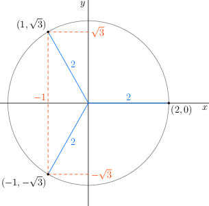

:::{aside} [Ingrid Daubechies](https://es.wikipedia.org/wiki/Ingrid_Daubechies)
es una matemática y
física belga. Ha realizado importantes aportaciones en el campo del
análisis de señales y la compresión de datos, con aplicaciones que van
desde la compresión de imágenes (como JPEG 2000) hasta el análisis de
señales en biomedicina.

```{figure} ./../images/Ingrid_Daubechies.jpg
:label: fig-Ingrid_Daubechies.jpg
:alt: retrato de Dra. Ingrid Daubechies
:align: center
Dra. Ingrid Daubechies (1954 - )
```
:::

```{note} Objetivos
Al completar esta lección, serás capaz de

1. **Definir y clasificar** las principales funciones de números complejos (potencias, raíces, exponenciales, logarítmicas, trigonométricas e hiperbólicas, y sus inversas), identificando sus dominios de analiticidad, periodicidad y ramificaciones.

2. **Resolver problemas** donde las funciones complejas simplifican la formulación matemática.
```

+++ { "part": "abstract" }

Las funciones elementales en el plano complejo —potencias, raíces, exponenciales, logaritmos, trigonométricas e hiperbólicas— son extensiones naturales de sus contrapartes reales, pero poseen propiedades mucho más ricas y complejas. Su estudio es fundamental en física e ingeniería, ya que permiten modelar fenómenos oscilatorios, de propagación y de atenuación con una eficacia que el cálculo real no puede alcanzar. Por ejemplo, la capacidad de las funciones complejas para manejar simultáneamente amplitud y fase simplifica drásticamente el análisis de circuitos eléctricos y ondas electromagnéticas. Además, conceptos como la multivaluación y las ramificaciones de las raíces y logaritmos son esenciales para comprender la estructura de las soluciones en problemas de valor de frontera y en mapeos conformes.
+++

# Funciones en el dominio complejo

Las funciones que estudiamos en cálculo real toman una nueva dimensión al extenderlas al plano complejo. Se conocen como *funciones elementales de números complejos* a las
potencias, raíces, funciones trigonométricas (y sus inversas),
logaritmos y exponenciales de números complejos, así como sus combinaciones.

El poder de estas funciones reside en que permiten una descripción más completa y eficaz de
muchos fenómenos físicos que involucran ondas, resonancia, circuitos, dinámica
de fluidos, entre otros. Mientras que en los números reales muchas operaciones están limitadas o requieren casos por separado, en el plano complejo, las identidades de Euler y las propiedades de la exponencial unifican trigonometría, geometría y álgebra en un solo lenguaje coherente.

```{note} Señal modulada en amplitud (AM)

En telecomunicaciones, transmitir una señal directamente es ineficiente. Una técnica común es la **modulación**, donde una señal de baja frecuencia (información) se impone sobre una onda de alta frecuencia (portadora).

Considera una señal de
información $m(t)$, que es una señal de banda base (por ejemplo, una
señal de audio). Esta señal se modula en amplitud (AM) utilizando una
portadora de frecuencia $f_c$, dando lugar a una señal modulada
$$s(t)=[A+m(t)]\cos(2\pi f_c t).$$

En lugar de trabajar directamente con $s(t)$, es común utilizar la
*representación compleja de la señal*, $S(t)$. La señal modulada se
puede expresar en términos de su envolvente compleja
$$s(t)=\Re \{S(t)e^{2\pi i f_c t}  \},$$ donde $$S(t)=A+m(t).$$

Esta formulación compleja simplifica enormemente el diseño de filtros y demoduladores.
```

## Potencias complejas

La operación de elevar un número complejo a una potencia entera es una extensión directa de la multiplicación. Dado un número complejo $z=re^{i\theta}$, donde $r$ es el módulo y
$\theta$ es el argumento de $z$, una potencia compleja $z
^n$, donde $n$ es un número entero, se define como
$$z^n=(re^{i\theta})^n=r^n e^{in\theta}.$$

Esto extiende la definición de potencias al plano complejo, conservando
la idea de multiplicar $z$ por sí mismo $n$ veces. Noten dos propiedades clave que emergen naturalmente:
1. El módulo se eleva a la potencia $n$: $$|z^n|=|z|^n.$$
2. El argumento se multiplica por $n$: $$\arg{(z^n)}=n(\arg{(z)}).$$

Esta última propiedad implica que elevar un número complejo a una potencia corresponde geométricamente a una rotación y un escalamiento en el plano de Argand.

:::{note} Teorema de De Moivre

El teorema de De Moivre es una consecuencia directa de la definición de potencias en forma polar y es fundamental para calcular potencias de números complejos.

$$(e^{i\theta})^n = \cos (n\theta) + i \sin (n\theta).$$

Este teorema nos permite conectar la trigonometría con el álgebra compleja.
:::

:::{note} Simplificación usando potencias

Calculemos $(\cos (\pi/10)+i\sin(\pi/10))^{25}$. En lugar de expandir el binomio, reconocemos la forma polar y aplicamos el teorema de De Moivre:

$$[\cos (\pi/10)+i\sin(\pi/10)]^{25}=(e^{i\pi/10})^{25}=e^{2i \pi}e^{i\pi /2}=1\cdot i=i$$

Observe lo simple que resulta el cálculo al usar el formalismo complejo.
:::

## Raíces complejas

Una de las diferencias más fascinantes entre los números reales y los complejos es que todo número complejo no nulo tiene exactamente $n$ raíces $n$-ésimas distintas. Las raíces de $n-$ésimo orden de un número complejo $z=re^{i\theta}$ se
obienen resolviendo la ecuación $w^n=z$.

Para encontrarlas, aprovechamos la periodicidad del argumento. Sabemos que $z = re^{i(\theta + 2k\pi)}$ para cualquier entero $k$. Las $n$ soluciones distintas se obtienen al distribuir este argumento periódico en $n$ partes iguales:

:::{math}
\begin{aligned}
    w_k=&\sqrt[n]{r}\cdot e^{i\left(\frac{\theta+2k\pi}{n} \right)}, \\
    =&\sqrt[n]{r}\left[ \cos \left(\frac{\theta+2k\pi}{n} \right)+i\sin\left(\frac{\theta+2k\pi}{n} \right)\right],\\
    &\text{con}\quad k=0,1,\ldots,n-1.
\end{aligned}
:::

Geométricamente, esto significa que las raíces forman los vértices de un polígono regular de $n$ lados inscrito en una circunferencia de radio $\sqrt[n]{r}$.

Note que $$|w_k|=\sqrt[n]{|z|}$$
y
$$\arg{(w_k)}=\frac{\arg{(z)}+2k\pi}{n}, \quad k=0,1,\ldots,n-1.$$

:::{note} Raíz cúbica
Ejemplo La ecuación $z^3=8$ tiene por solución
$$z=\sqrt[3]{8}=\left\{2, -1+i\sqrt{3}, -1-i\sqrt{3}\right\}$$

Geométricamente, estas tres soluciones están separadas por $120^\circ$ en el plano complejo.


:::


## Exponencial de un número complejo

La función exponencial es quizás la función más importante en el análisis complejo, ya que conecta todas las demás. Si $z=x+iy$, la función exponencial de $z$ se define mediante
$$e^z=e^{x+iy}=e^xe^{iy}=e^x(\cos y +i\sin y).$$

Esta definición preserva la propiedad fundamental $e^{z_1+z_2} = e^{z_1}e^{z_2}$.

Analizando esta expresión, podemos observar dos comportamientos distintos:
:::{math}
\begin{aligned}
|e^z|=&|e^x||e^{iy}| = e^x \cdot 1 = e^x,\\
\arg (e^z)=&y.
\end{aligned}
:::

*   La parte real $x$ controla la **magnitud** (crece o decae exponencialmente).
*   La parte imaginaria $y$ controla la **rotación** (oscila periódicamente).

:::{note} Simplificación

Ejemplo numérico: $e^{2-i\pi}$.
Separamos la parte real y la imaginaria:
$$e^{2-i\pi}=e^2 \cdot e^{-i\pi} = e^2 (\cos(-\pi) + i\sin(-\pi)) = e^2(-1 + 0i) = -e^2.$$
:::

:::{note} Índice de refracción complejo

La función exponencial compleja es la herramienta perfecta para describir ondas que sufren absorción. En medios dieléctricos ideales, el **índice de refracción** $ n $ relaciona la velocidad de la luz en el vacío $ c $ con la velocidad de propagación $ v $ en el medio:
$$
n = \frac{c}{v}.
$$

Sin embargo, en muchos materiales reales —especialmente en aquellos donde hay **absorción** o **dispersión** de la onda electromagnética— el índice de refracción se vuelve **complejo**:
$$
\tilde{n} = n + i \kappa.
$$


- La **parte real** $ n $ describe la **fase** de la onda y controla la velocidad de fase y la refracción:
  $$
  v_p = \frac{c}{n}.
  $$
- La **parte imaginaria** $ \kappa $ (llamada coeficiente de extinción) está asociada con la **atenuación** o **absorción** de la onda en el medio.

Cuando una onda electromagnética de frecuencia $ \omega $ y número de onda $ k $ viaja en el medio, su forma es
$$
E(z,t) = E_0\, e^{i(kz - \omega t)}.
$$

Si $ k = \frac{\omega}{c} \tilde{n} = \frac{\omega}{c}(n+i\kappa) $, entonces

$$
E(z,t) = E_0\, e^{i \frac{\omega}{c} n z} \, e^{-\frac{\omega}{c} \kappa z} \, e^{-i\omega t}.
$$

Aquí es donde vemos la magia de $e^z$:
*   El término $e^{-i\omega t}$ da la oscilación temporal.
*   El término $e^{i \frac{\omega}{c} n z}$ da la propagación espacial (fase).
*   El término $ e^{-\frac{\omega}{c} \kappa z} $ muestra que $ \kappa $ controla la **tasa de decaimiento** de la amplitud conforme la onda avanza (absorción).

:::


## Funciones trigonométricas

Las funciones trigonométricas en el plano complejo se definen a partir de la exponencial, lo que nos permite calcular senos y cosenos de números que no son ángulos reales. Dado que
:::{math}
\begin{aligned}
    e^{i\theta}=\cos\theta +i\sin\theta,\\
    e^{-i\theta}=\cos\theta -i\sin\theta,
\end{aligned}
:::

se pueden expresar las funciones trigonométricas de
números reales resolviendo el sistema para $\cos$ y $\sin$:
:::{math}
\begin{aligned}
    \sin \theta=&\frac{e^{i\theta}-e^{-i\theta}}{2i},\\
    \cos \theta=&\frac{e^{i\theta}+e^{-i\theta}}{2};
\end{aligned}
:::

Para extender esto a números complejos, simplemente reemplazamos $\theta$ por una variable compleja $z$:

$$\sin z=\frac{e^{iz}-e^{-iz}}{2i},$$
$$\cos z=\frac{e^{iz}+e^{-iz}}{2}.$$

```{note} Ejemplos de trigonométricas complejas

Calculemos $\sin \left(\frac{\pi}{2}+i\ln 2 \right)$ y $\cos i$.

:::{math}
\begin{aligned}
    \sin \left(\frac{\pi}{2}+i\ln 2 \right)=&\frac{e^{i(\pi/2+i\ln 2)}-e^{-i(\pi/2+i\ln 2)}}{2i}\\
    =&\frac{e^{i\pi /2}e^{-\ln 2}-e^{-i\pi /2}e^{\ln 2}}{2i}\\
    =&\frac{(i)(1/2)-(-i)(2)}{2i}\\
    =&\frac{5}{4}
\end{aligned}
:::

Note que el resultado es real y mayor que 1, algo imposible para el seno de un ángulo real.

---

$$\cos i= \frac{e^{i\cdot i}+e^{-i\cdot i}}{2}=\frac{e^{-1}+e}{2} \approx 1.543$$
```

Note de los ejemplos anteriores que los senos y cosenos de números
complejos pueden ser mayores que 1 o ser puramente reales, perdiendo las limitaciones de rango que tienen en los números reales.

Las otras funciones trigonométricas de argumento complejo se definen en
la manera usual, en términos de las funciones $\sin$ y $\cos$; por
ejemplo $\tan z=\sin z / \cos z$, etc. Esto significa que tendrán polos (singularidades) donde el denominador se anule.

## Funciones hiperbólicas complejas

Existe una conexión profunda y elegante entre la trigonometría circular ($\sin, \cos$) y la trigonometría hiperbólica ($\sinh, \cosh$). Para descubrirla, evaluemos las funciones trigonométricas estándar en el eje imaginario puro, es decir, para $z=iy$:

:::{math}
\begin{aligned}
    \sin iy =&\frac{e^{i(iy)}-e^{-i(iy)}}{2i} = \frac{e^{-y}-e^{y}}{2i}= -i\frac{e^{y}-e^{-y}}{2},\\
    \cos iy =&\frac{e^{i(iy)}+e^{-i(iy)}}{2} = \frac{e^{-y}+e^{y}}{2}=\frac{e^{y}+e^{-y}}{2}.
\end{aligned}
:::

Las funciones reales que aparecen a la derecha se conocen como [funciones hiperbólicas](https://es.wikipedia.org/wiki/Funci%C3%B3n_hiperb%C3%B3lica) (seno hiperbólico y coseno hiperbólico):

:::{math}
\begin{aligned}
    \sinh y =&\frac{e^{y}-e^{-y}}{2},\\
    \cosh y =&\frac{e^{y}+e^{-y}}{2}.
\end{aligned}
:::

De esto derivamos las relaciones de puente entre ambos mundos:
:::{math}
\begin{aligned}
    \sin iy =& i\sinh y,\\
    \cos iy =& \cosh y.
\end{aligned}
:::

Para argumentos complejos generales $z = x + iy$, las definiciones se extienden naturalmente como:

:::{math}
\begin{aligned}
    \sinh z=&\frac{e^{z}-e^{-z}}{2},\\
    \cosh z=&\frac{e^{z}+e^{-z}}{2}.
\end{aligned}
:::

:::{note} Ejemplos de funciones hiperbólicas

$$\sinh (1+i) = -i \sin (i(1+i)) = -i \sin (-1+i)$$

$$\cosh (i) = \cos (i \cdot i) = \cos(-1) = \cos(1) \approx 0.540$$
:::


### Propiedades de las funciones hiperbólicas complejas

Las funciones hiperbólicas comparten muchas propiedades con las trigonométricas, pero con diferencias de signo cruciales.

*   **Ecuación Diferencial:** Las funciones $\sinh (z)$ y $\cosh(z)$ son soluciones de la ecuación diferencial de segundo orden:
    $$\frac{d^2 w}{dz^2}=w.$$
    (Compare con $w'' + w = 0$ para seno y coseno).

*   **Analiticidad:** Las funciones hiperbólicas complejas son analíticas (diferenciables en todo el plano complejo) y tienen
    derivadas "similares" a las de sus contrapartes reales:
    $$\frac{d}{dz} \sinh{z}=\cosh (z), \quad  \frac{d}{dz} \cosh{z}=\sinh (z)$$

*   **Identidad Fundamental:** La identidad pitagórica $\sin^2 + \cos^2 = 1$ cambia de signo en el mundo hiperbólico:
    $$\cosh ^2 z -\sinh ^2 z = 1$$


:::{seealso} Referencias

@boas2006mathematical [Cap. 2 "Complex Numbers", pág. 64-71]

:::