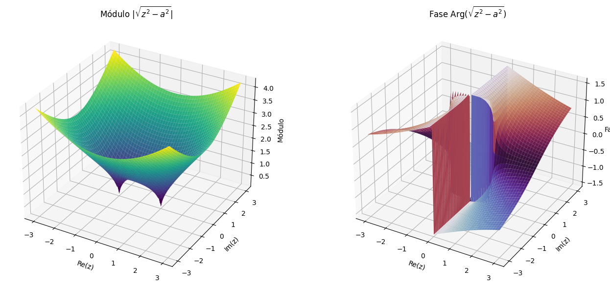

:::{aside} [Ana María Cetto](https://es.wikipedia.org/wiki/Ana_Mar%C3%ADa_Cetto)

Física teórica mexicana, Investigadora Titular del Instituto de Física de la UNAM y profesora de la Facultad de Ciencias, figura central de la física latinoamericana contemporánea tanto por su producción científica como por su liderazgo internacional. Su línea central son los fundamentos de la mecánica cuántica y la electrodinámica estocástica lineal. Primera latinoamericana Secretaria General del Consejo Internacional para la Ciencia (ICSU, 2002); vicepresidenta fundadora de TWOWS (mujeres en ciencia para el mundo en desarrollo); presidenta fundadora de Latindex (1997), el sistema de revistas científicas iberoamericanas; promotora del Museo de la Luz de la UNAM y del Año Internacional de la Luz 2015; presidenta del Comité Directivo Mundial de Ciencia Abierta de la UNESCO (2023); presidenta de la Sociedad Mexicana de Física (2021–2023).
```{figure} ./../images/Ana_Maria_Cetto.png
:label: fig-Ana_Maria_Cetto.png
:alt: retrato de Dra. Ana María Cetto
:align: center
Ana María Cetto (1946 - ). Foto: The Official CTBTO Photostream ([Wikimedia Commons](https://commons.wikimedia.org/wiki/File%3AAna_Maria_Cetto.jpg), CC BY 2.0).
```
:::

```{note} Objetivos
Al completar esta lección, serás capaz de

1. **Construir y usar el logaritmo complejo**, distinguiendo el logaritmo multivaluado ($\ln$) de su rama principal ($\text{Log}$), y aplicarlo para extraer módulo, fase, potencias e inversas de funciones.

2. **Interpretar geométricamente la multivaluación** en términos de puntos de ramificación, cortes de rama (branch cuts) y superficies de Riemann, visualizando las distintas ramas de una función.

3. **Elegir ramas con criterio físico** en problemas de óptica, circuitos y ondas, obteniendo soluciones consistentes (por ejemplo, distinguir modos propagantes de modos evanescentes).
```

+++ { "part": "abstract" }

En la semana anterior construimos las funciones elementales de variable compleja a partir de un solo ingrediente, la exponencial $e^z$. Esta semana atacamos la pregunta inversa: **¿cómo se "deshace" la exponencial?** La respuesta es un único ladrillo, el **logaritmo complejo**, y un único obstáculo, su naturaleza **multivaluada**. Con ese ladrillo levantaremos todo lo demás: las potencias complejas $a^b$, las funciones trigonométricas inversas y las hiperbólicas inversas, que resultan ser todas "logaritmos disfrazados". Cerramos con una aplicación donde la elección de la rama del logaritmo decide un resultado físico real: separar modos **propagantes** de modos **evanescentes** en la propagación de ondas.

+++

En la semana 5 estudiamos las funciones elementales del plano complejo: la exponencial $e^z$ y, con ella, las trigonométricas ($\sin z$, $\cos z$, $\tan z$), las hiperbólicas ($\sinh z$, $\cosh z$, ...) y las potencias y raíces. Vimos también, por primera vez, el logaritmo de un número complejo.

Ahora invertimos el punto de vista. En cálculo de variable real, $\ln x$ "deshace" a $e^x$: es su función inversa. ¿Funciona lo mismo en el plano complejo? La respuesta es **no tan rápido**: la exponencial compleja es periódica,

$$
e^{z+2\pi i}=e^z,
$$

de modo que muchos valores distintos de $z$ producen el mismo $e^z$. Deshacer la exponencial, entonces, **no tiene una respuesta única**, y esa ambigüedad se propagará a todo lo que construyamos encima: potencias, arcosenos, arcosenos hiperbólicos.

# El logaritmo: deshacer la exponencial

Busquemos explícitamente la inversa de $e^z$: dado $z\neq 0$, queremos todos los $w$ tales que $e^w=z$. Escribamos $z=re^{i\theta}$ en forma polar y $w=u+iv$; entonces

$$
e^w=e^{u}e^{iv}=re^{i\theta}
\quad\Longrightarrow\quad
u=\ln r,\qquad v=\theta+2k\pi,\quad k\in\mathbb{Z}.
$$

La parte real es única, pero la parte imaginaria está definida **salvo múltiplos de $2\pi$**: cada vuelta completa alrededor del origen reproduce el mismo $z$. Definimos así el **logaritmo complejo multivaluado**,

$$
\ln z=\ln|z|+i(\theta+2k\pi)=\ln|z|+i\arg z,\qquad k\in\mathbb{Z},
$$

y su **rama principal**, restringiendo el argumento al intervalo $(-\pi,\pi]$:

$$
\text{Log }z=\ln|z|+i\,\text{Arg }z,\qquad \text{Arg }z\in(-\pi,\pi].
$$

:::{note} Convención de notación

- $\ln z$: logaritmo **multivaluado** (un conjunto de valores).
- $\text{Log }z$: **rama principal** (un solo valor, con $-\pi<\text{Arg }z\le\pi$).
:::

La estructura del logaritmo es una "descomposición": separa la información de módulo y fase de cualquier número complejo,

:::{math}
\begin{aligned}
    \Re\left(\ln z\right)= \ln |z|,\\
    \Im\left(\ln z\right)=\arg z.
\end{aligned}
:::

Dos consecuencias inmediatas:

- El logaritmo existe para **todo** $z\neq 0$: en el dominio complejo, $\ln(-2)$ sí tiene valor.
- Extraer la **fase** de una señal compleja es tomar la parte imaginaria de su logaritmo.

:::{note} Ejemplo: dos logaritmos concretos

Para $z=1+i$: $r=\sqrt{2}$ y $\theta=\pi/4$, de donde

$$
\ln(1+i)=\frac{1}{2}\ln 2+i\left(\frac{\pi}{4}+2k\pi\right),
\qquad
\text{Log}(1+i)=\frac{1}{2}\ln 2+i\frac{\pi}{4}.
$$

Para $z=-2$, que en polar es $2e^{i\pi}$:

$$
\ln(-2)=\ln 2+i\left(\pi+2k\pi\right),
\qquad
\text{Log}(-2)=\ln 2+i\pi.
$$

El valor principal $\text{Log}(-2)=\ln 2+i\pi$ condensa la información completa: magnitud $\ln 2$ y fase $\pi$ (el número apunta "hacia la izquierda").
:::

## Propiedades 

Las reglas clásicas del logaritmo sobreviven en el plano complejo, con un matiz:

-   Logaritmo de un producto: $\ln (z_1 z_2)=\ln (z_1)+\ln (z_2)$
-   Logaritmo de un cociente: $\ln \left(\dfrac{z_1}{z_2} \right)=\ln (z_1)-\ln (z_2)$
-   Logaritmo de una potencia: $\ln (z^n)=n\ln (z)$
-   Relación con la exponencial: $e^{\ln z}=z$ y $\ln (e^z)=z+2k\pi i$


:::{note} Extraer la fase: análisis de impedancia

En circuitos de corriente alterna, el voltaje se representa como un fasor

$$
V = V_0 e^{i(\omega t + \phi)}.
$$

Para recuperar la fase $\phi$ basta tomar el logaritmo y quedarse con la parte imaginaria:

$$
\theta = \Im\big(\ln V(t)\big) = \omega t+\phi \pmod{2\pi}.
$$

:::

## La geometría de la multivaluación: ramas y cortes

¿Por qué el logaritmo es multivaluado? La respuesta es geométrica. Imaginen caminar en el plano $z$ dando una vuelta completa alrededor del origen: el argumento varía continuamente y regresa al punto de partida, pero habiendo acumulado $+2\pi$. Como $\Im(\ln z)=\arg z$, **el valor del logaritmo subió un "piso"**: de $\text{Log}\,z$ a $\text{Log}\,z+2\pi i$. El logaritmo vive, en realidad, sobre una escalera helicoidal de pisos apilados: la [superficie de Riemann](https://es.wikipedia.org/wiki/Superficie_de_Riemann) del logaritmo, donde cada "hoja" o piso corresponde a un valor de $k$.


```{figure} ./../images/re_ln.png
:label: fig-re_ln.png
:alt: Gráficos de la parte real de logaritmo
:align: center
Parte real del logaritmo .
```

```{figure} ./../images/im_ln.png
:label: fig-im_ln.png
:alt: Gráfico de la parte imaginaria de logaritmo
:align: center
Parte imaginaria del logaritmo.
```

```{figure} ./../images/riemann_gradiente.png
:label: fig-riemman_gradiente.png
:alt: Superficie de Riemman de logaritmo
:align: center
Superficie de Riemman del logaritmo.
```

Para trabajar en el plano (una sola hoja) necesitamos dos herramientas:

- Un **punto de ramificación**: un punto alrededor del cual una vuelta cambia el valor de la función. Para $\ln z$ (y para $\sqrt{z}$ y $z^\alpha$ no entero) es $z=0$, además de $z=\infty$.
- Un **corte de rama** (*branch cut*): una curva que "cortamos" del dominio para impedir rodear el punto de ramificación, de modo que sobre la región restante la función sea univaluada. La elección estándar para $\ln z$ es el eje real negativo $(-\infty,0]$, que es justamente donde la rama principal "salta" de $+i\pi$ a $-i\pi$.

:::{attention} Tabla de referencia: puntos de ramificación de las funciones de esta semana
:class: dropdown

La siguiente tabla resume, dónde se ramifica cada función que construiremos y dónde aparecen en la física:

| Función $f(z)$            | Puntos de ramificación          | Corte de rama típico                  | Aplicaciones en física e ingeniería                              |
|-----------------------------|----------------------------------|---------------------------------------|------------------------------------------------------------------|
| $ \sqrt{z} $               | $ z = 0, \infty $              | Eje real negativo $ (-\infty, 0] $   | Potenciales en 2D, elasticidad, flujo de fluidos   |
| $ \ln(z) $                | $ z = 0, \infty $              | Eje real negativo $ (-\infty, 0] $   | Circuitos, óptica, mecánica cuántica                  |
| $ z^\alpha $ ($\alpha \notin \mathbb{Z}$) | $ z = 0, \infty $  | Eje real negativo $ (-\infty, 0] $   | Propagación de ondas, ecuaciones diferenciales                    |
| $ \arcsin(z) $             | $ z = \pm 1, \infty $          | $ (-\infty,-1] \cup [1,\infty) $     | Vibraciones, análisis estructural, transformaciones conformes     |
| $ \arccos(z) $             | $ z = \pm 1, \infty $          | $ (-\infty,-1] \cup [1,\infty) $     | Fenómenos oscilatorios, teoría de control                         |
| $ \arctan(z) $             | $ z = \pm i, \infty $          | $ i[-\infty,-1] \cup i[1,\infty) $   | Procesamiento de señales, telecomunicaciones                      |
| $ \sinh^{-1}(z) $            | $ z = \pm i, \infty $          | $ i[-\infty,-1] \cup i[1,\infty) $   | Propagación en medios dispersivos, relatividad                    |
| $ \cosh^{-1}(z) $            | $ z = \pm 1, \infty $          | $ (-\infty,1] $                      | Termodinámica, física estadística                    |

Nóte que **las ramificaciones nacen de los $\ln$ y las $\sqrt{\ }$ que quedan dentro de cada fórmula**.
:::


# Potencias complejas: el logaritmo trabajando

¿Qué significa $a^b$ cuando $a$ y $b$ son complejos? La definición se apoya por completo en el logaritmo:

$$
a^b=e^{b\ln a}.
$$

Si $\ln a$ toma varios valores, $a^b$ también: las potencias complejas **heredan** la multivaluación del logaritmo (salvo cuando $b$ es entero, caso en el que todos los valores coinciden).

:::{note} Ejemplo: $i^{-2i}$ es un número real

Calculemos primero $\ln i = i\left(\frac{\pi}{2}+2k\pi\right)$. Entonces

$$
i^{-2i}=e^{-2i\,\ln i}
=e^{-2i\cdot i(\pi/2+2k\pi)}
=e^{\pi+4k\pi}
=e^\pi,\; e^{5\pi},\; e^{9\pi},\;\ldots
$$

Todos los valores son **reales y positivos** — un resultado que sorprende a primera vista: dos números imaginarios producen infinitos valores reales.
:::

# Funciones trigonométricas inversas: el mismo ladrillo

En la semana 5 definimos, por ejemplo, $\cos z=\dfrac{e^{iz}+e^{-iz}}{2}$: para cada $z$ de entrada, la fórmula produce un número $w=\cos z$. La función inversa recorre el camino contrario:

$$
z=\cos^{-1} w=\arccos w \qquad \text{si}\quad w=\cos z,
$$

y de la misma forma $\arcsin w$, $\arctan w$, etc. Estas funciones son esenciales para recuperar **ángulos de fase** en el plano complejo, con aplicaciones en mecánica cuántica y teoría de control, donde la respuesta de sistemas oscilatorios exige reconstruir fases a partir de amplitudes.

¿Cómo se calcula una inversa compleja? No hay tabla ni calculadora que baste: hay que **resolver la ecuación**. Y al hacerlo aparece, una y otra vez, el mismo patrón de tres pasos:

1. Sustituir $u=e^{iz}$ (o $u=e^{z}$).
2. Obtener una **ecuación cuadrática** en $u$.
3. Despejar $u$ y aplicar el **logaritmo**.

:::{note} Ejemplo patrón: $\arccos 2$

Busquemos $z$ tal que $\cos z=2$ — imposible en los reales, donde $\cos$ está entre $-1$ y $1$, pero perfectamente posible en el plano complejo:

$$
\frac{e^{iz}+e^{-iz}}{2}=2.
$$

Con $u=e^{iz}$ (y por tanto $e^{-iz}=u^{-1}$):

$$
\frac{u+u^{-1}}{2}=2
\;\Longrightarrow\;
u^2-4u+1=0
\;\Longrightarrow\;
u=e^{iz}=2\pm\sqrt{3}.
$$

Aplicando logaritmo a ambos lados:

$$
iz=\text{Log}(2\pm\sqrt{3})+2k\pi i=\pm\ln(2+\sqrt{3})+2k\pi i,
$$

$$
\boxed{\;z=\arccos 2=\pm i\ln(2+\sqrt{3})+2k\pi\;}
$$

El resultado es **completamente imaginario** (salvo los múltiplos de $2\pi$): el arcocoseno de 2 existe y vive en el eje imaginario. Nótese además que ya apareció la multivaluación por partida doble: por el $2k\pi$ del logaritmo y por el $\pm$ de la raíz cuadrada.
:::

Repitiendo el patrón anterior (sustituir, resolver la cuadrática, tomar logaritmo) se obtienen las fórmulas generales, válidas para $z$ complejo:

:::{math}
:label: eq-inversas-trig
\begin{aligned}
    \sin^{-1}(z)=&-i\ln\left(iz+\sqrt{1-z^2}\right),\\
    \cos^{-1}(z)=&-i\ln\left(z+i\sqrt{1-z^2}\right),\\
    \tan^{-1}(z)=&\displaystyle \frac{i}{2}\ln \left (\frac{i+z}{i-z}\right),\quad z\neq \pm i,\\
    \cot^{-1}(z)=&\displaystyle -\frac{i}{2}\ln \left (\frac{z+i}{z-i}\right),\quad z\neq \pm i,\\
    \sec^{-1}(z)=&-i\ln \left(\frac{1+\sqrt{1-z^2}}{z} \right),\\
    \csc^{-1}(z)=&-i\ln \left(\frac{1+\sqrt{z^2-1}}{z} \right).
\end{aligned}
:::

Miren las fórmulas {eq}`eq-inversas-trig` con los ojos de esta semana: **todas son logaritmos con una raíz cuadrada dentro**. Eso explica dos cosas a la vez:

- Son **multivaluadas**, por partida doble: el $\ln$ aporta los saltos de $2\pi$ y la $\sqrt{\ }$ aporta un signo $\pm$.
- Sus **puntos de ramificación** ocurren donde las raíces se anulan ($z=\pm 1$ para $\arcsin$ y $\arccos$) o donde el argumento del logaritmo se anula o diverge ($z=\pm i$ para $\arctan$), tal como anticipa la tabla de referencia.

# Funciones hiperbólicas inversas: logaritmos a secas

Las soluciones de ecuaciones diferenciales que describen propagación de ondas y transmisión de señales se expresan frecuentemente en términos de funciones hiperbólicas inversas. Su construcción es el mismo patrón de la sección anterior, pero con una simplificación: como las hiperbólicas se escriben con $e^{\pm z}$ (sin el $i$ de las trigonométricas), las fórmulas resultan ser **logaritmos sin factores $\pm i$**:

:::{math}
:label: eq-inversas-hip
\begin{aligned}
    \sinh^{-1}(z)=&\ln\left(z+\sqrt{z^2+1}\right),\\
    \cosh^{-1}(z)=&\ln\left(z+\sqrt{z^2-1}\right),\\
    \tanh^{-1}(z)=&\displaystyle \frac{1}{2}\ln \left (\frac{1+z}{1-z}\right).
\end{aligned}
:::

Nuevamente, cada fórmula esconde un logaritmo y una raíz, de modo que la multivaluación y los puntos de ramificación ($z=\pm i$ o $z=\pm 1$, según la función) siguen el patrón de la tabla de referencia.

Dos aplicaciones donde aparecen de manera natural:

- **Relatividad especial:** la *rapidez* (velocidad adimensional) $\phi=\tanh^{-1}(v/c)$ convierte la composición no lineal de velocidades relativistas en una simple suma de rapideces: $\phi=\phi_1+\phi_2$.
- **Transferencia de calor:** $\tanh^{-1}$ y $\cosh^{-1}$ aparecen al resolver problemas de conducción en medios seminfinitos y perfiles de temperatura estacionarios.

:::{note} Derivadas de las funciones hiperbólicas inversas

| Función                    | Expresión de la derivada |
|----------------------------|--------------------------|
| $\sinh^{-1}(z)$  | $\displaystyle \frac{1}{\sqrt{z^2+1}}$|
| $\cosh^{-1}(z)$  | $\displaystyle \frac{1}{\sqrt{z^2-1}}$|
| $\tanh^{-1}(z)$  | $\displaystyle \frac{1}{1-z^2}$       |

Las derivadas son racionales o radicales "sencillas": al derivar, el logaritmo desaparece. Por eso estas funciones aparecen con tanta frecuencia como antiderivadas al integrar ecuaciones de onda y de calor.
:::

# Aplicación integradora: del corte de rama a la onda evanescente

Cerramos la semana donde todo se junta: un problema físico cuya solución **depende de elegir bien la rama del logaritmo**.

En física e ingeniería, las **ecuaciones de ondas** describen la propagación de perturbaciones (sonido, electromagnetismo, elasticidad). En 2D, la ecuación de onda homogénea para un campo escalar $u(x,y,t)$ es

$$
\nabla^2 u - \frac{1}{c^2}\frac{\partial^2 u}{\partial t^2} = 0,
$$

donde $c$ es la velocidad de propagación. Si buscamos soluciones armónicas en el tiempo, $u(x,y,t)=U(x,y)e^{-i\omega t}$, la ecuación se transforma en la **ecuación de Helmholtz**:

$$
\nabla^2 U + k^2 U = 0,
\qquad k=\omega/c.
$$

La respuesta a una fuente puntual se describe con la [función de Green](https://es.wikipedia.org/wiki/Funci%C3%B3n_de_Green), que resuelve

$$
\nabla^2 G + k^2 G = \delta(x)\delta(y).
$$

Para geometrías especiales — [guías de ondas](https://es.wikipedia.org/wiki/Gu%C3%ADa_de_onda), medios estratificados, arreglos de fuentes — la solución se escribe en términos de la variable compleja como una forma generalizada

$$
G(z)=\sqrt{z^2-a^2},
$$

donde $a$ es una distancia característica (la separación entre fuentes, el borde de la guía, o el umbral entre propagación y no-propagación):



Analicemos $G(z)$ con las herramientas de esta semana. Primero la escribimos en términos del logaritmo:

$$
G(z)=\sqrt{z^2-a^2}=\exp\!\Big(\tfrac{1}{2}\ln\big(z^2-a^2\big)\Big).
$$

**¿Dónde se ramifica?** Donde el argumento del logaritmo se anula:

$$
z^2-a^2=0 \quad\Longrightarrow\quad z=\pm a,
$$

más el punto $z=\infty$ en el plano de Riemann compacto. Para hacer $G(z)$ univaluada elegimos el **corte de rama** que une los dos puntos de ramificación: el segmento real $[-a,a]$, y definimos la rama principal con $\arg(z^2-a^2)\in(-\pi,\pi]$.

**¿Qué significa físicamente?** Si $z$ es un número de onda o una variable espectral — el papel típico de $z$ en las funciones de Green — los puntos $z=\pm a$ marcan un **umbral** entre dos regímenes:

- $|z|>a$: $z^2-a^2>0$ y $\sqrt{z^2-a^2}$ es **real** → la onda **propaga** (modos propagantes).
- $|z|<a$: $z^2-a^2<0$ y $\sqrt{z^2-a^2}$ es **imaginario** → la amplitud decae exponencialmente sin propagar energía: la **onda evanescente** ([ver en Wikipedia](https://es.wikipedia.org/wiki/Onda_evanescente)).

El corte de rama $[-a,a]$ no es un artificio de cálculo: **es la frontera física entre los dos regímenes**, y elegir la rama principal equivale a imponer la convención física correcta (la solución de radiación saliente). Lo que en la sección de logaritmos era un salto de $2\pi i$ en un plano complejo, aquí se manifiesta como la transición entre una onda que viaja y una que se apaga.

# Resumen: el mapa de la semana

- Toda la semana responde a una pregunta: **¿cómo se deshace $e^z$?** La respuesta es el logaritmo $\ln z=\ln|z|+i\arg z$, multivaluado por la periodicidad $2\pi i$ de la exponencial.
- La **rama principal** $\text{Log}\,z$ (con $\text{Arg}\,z\in(-\pi,\pi]$) convierte al logaritmo en función univaluada; las reglas algebraicas del logaritmo valen entre conjuntos de valores, pero la rama principal puede fallar en múltiplos de $2\pi i$.
- La multivaluación es un fenómeno **geométrico**: rodear un punto de ramificación cambia de "piso" en la superficie de Riemann; un **corte de rama** mantiene la función univaluada.
- Las **potencias complejas** $a^b=e^{b\ln a}$ y **todas las inversas** (trigonométricas e hiperbólicas) se construyen con el mismo patrón: sustituir $u=e^{(\cdot)}$, resolver una cuadrática y aplicar logaritmo. Todas son logaritmos disfrazados y heredan sus ramificaciones.
- En la **aplicación final**, la elección de rama de $\sqrt{z^2-a^2}$ decide la física: modos propagantes ($|z|>a$) frente a modos evanescentes ($|z|<a$).

:::{seealso} Referencias

@boas2006mathematical [Cap. 2 "Complex Numbers", pág. 72-81]

:::

:::{note} Transparencia: uso de inteligencia artificial

Esta lección fue preparada con asistencia de un modelo de lenguaje (GLM, Z.ai) para la reorganización pedagógica del hilo conductor, la verificación de fórmulas y notación, y la corrección de erratas. Todo el contenido fue revisado, verificado y aprobado por el docente del curso, quien asume la responsabilidad académica del material.
:::
